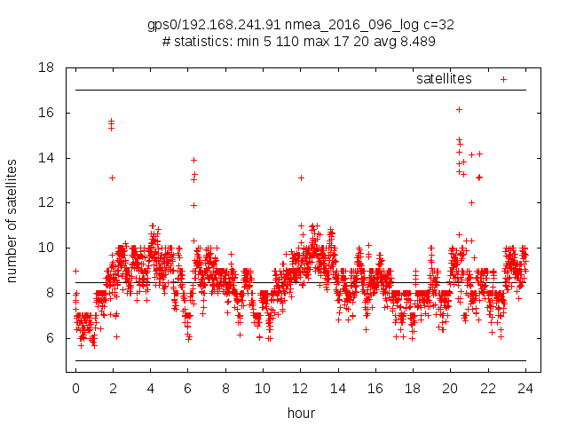
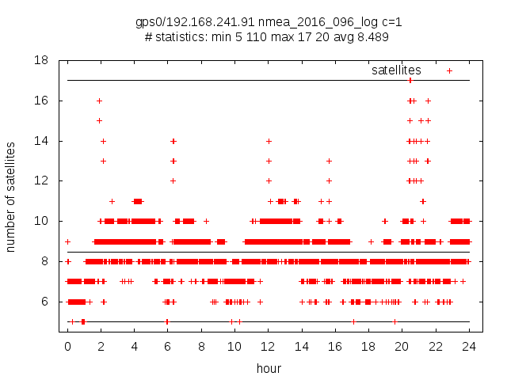

### graph to show available satellites over 24 hours 

for UNIX like systems

ksh scripts using gawk, gnuplot and gnuplot-x11

##  sat_usage_ksh

show number of satellites as graph - v 2016 02 06
usage: /opt/iiasa/bin/sat_usage_ksh [ -c COUNT ] [ -f IMG ] FILE
       COUNT >= 1
       -f IMG      - output to file - IMG can be jpeg, png, ...

### examples

#### sat_usage_ksh -c 32 -f png  /var/adm/nmea_2016_096_log

#### sat_usage_ksh -f png  /var/adm/nmea_2016_096_log

